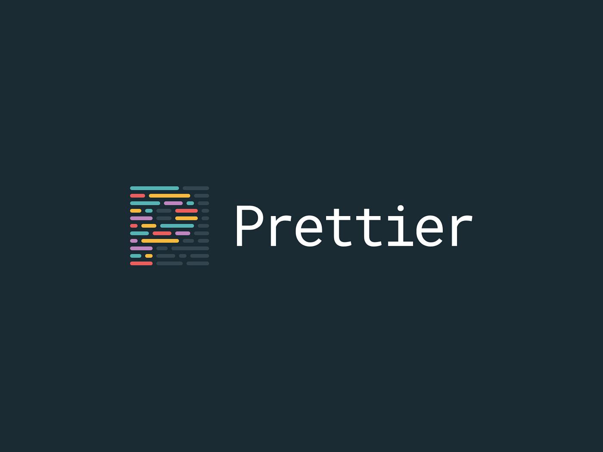
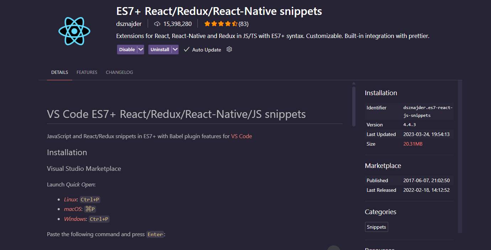
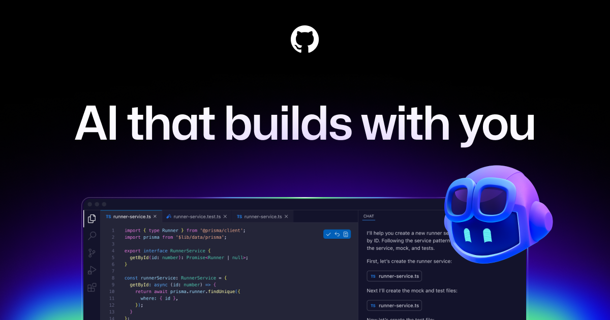
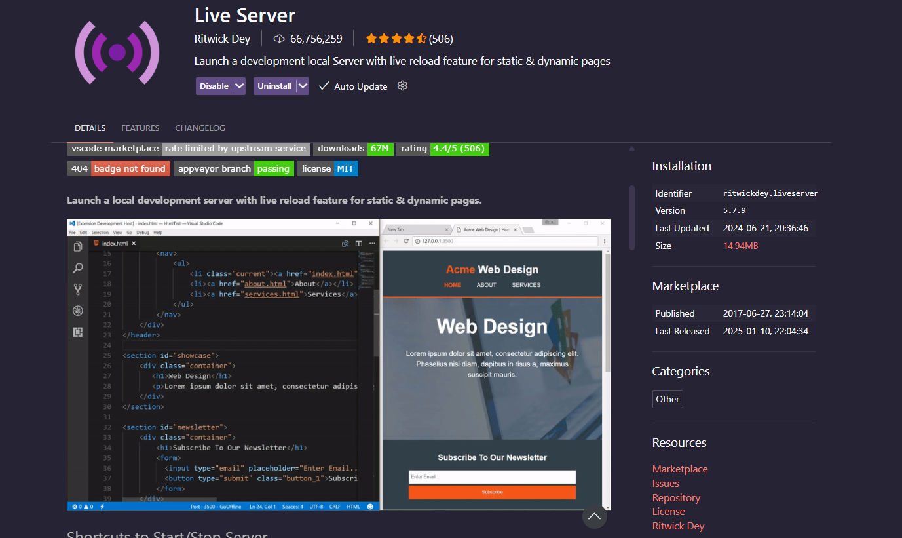
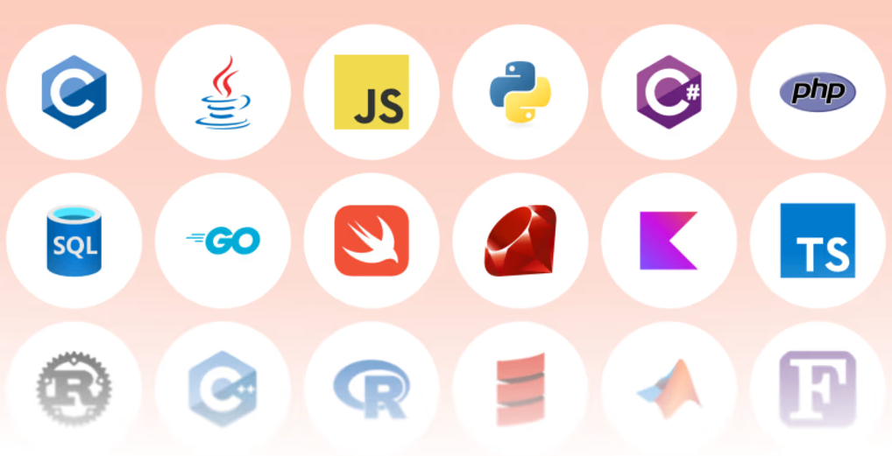
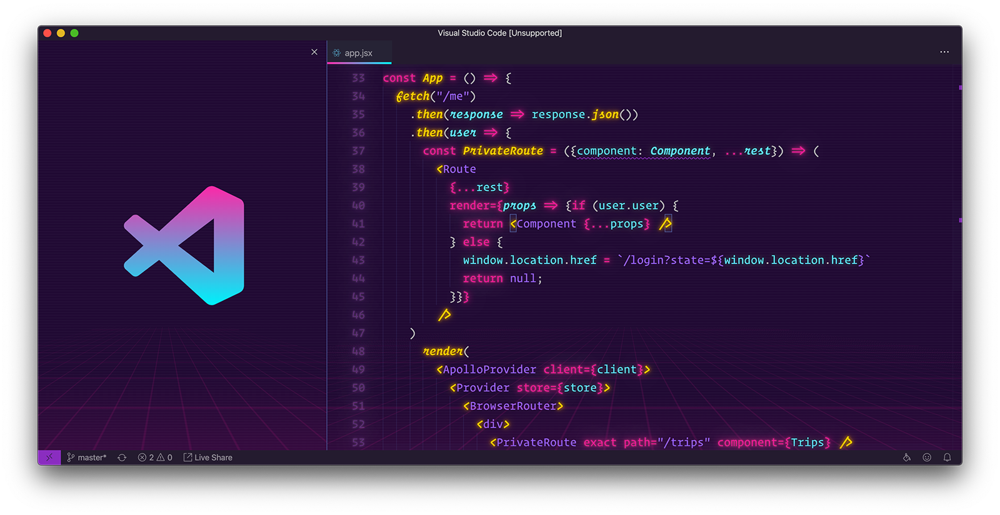
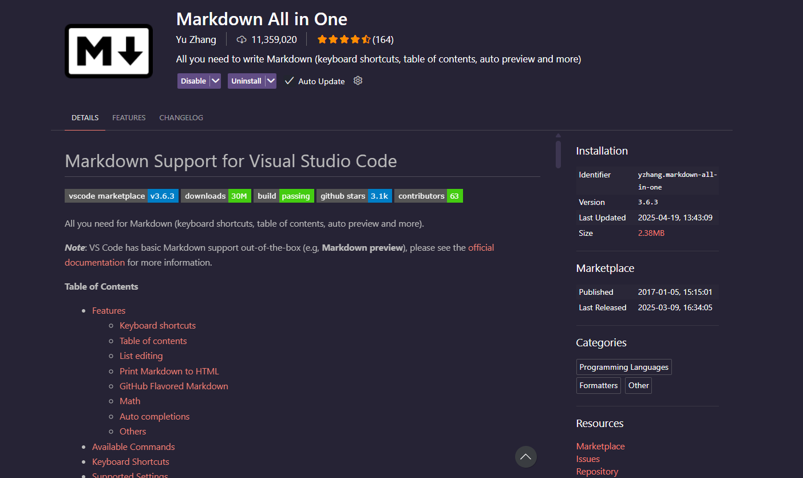

I've seen countless posts related to the almost infinite extensions that developers like to use in their environments.

While most of them usually are the same, I found sometimes hidden gems that really boosted my productivity, or made my coding experience more delightful.

In this post, I want to share some of my favorite VS Code extensions that I believe can help you too.

## 1. Prettier - Code formatter

Although obvious, it is a game-changer. 

Having your code consistently formatted provides you with a clean and readable codebase, less prone to errors, easier to maintain, and easier to troubleshoot.

On top of that, Prettier integrates seamlessly with VS Code and with this new AI era, it can help you automatically format your code as you type, making the development process even smoother.

## 2. ES7+ React/Redux/React-Native snippets

If you code in React or React-Native, this extension is a must. With a powerful set of snippets and the ability to quickly generate boilerplate code, it will speed up your development process significantly.

## 3. GitHub Copilot 

In the AI era, not having an AI assistant to code is like working decades behind the curve. Allowing your competitors to have access to this technology while you don't is a surefire way to fall behind.

So yes, it is another must. 

With Copilot, either the free version or any other AI-powered coding assistant, you will see your coding capabilities strongly enhanced for a near-to-zero cost. 

## 4. Live Server 

In this case, as it happens to ES7+ React/Redux/React-Native snippets, Live Server is another essential tool for modern web development. 

If you are a front-end developer or you constantly work with web applications, Live Server allows you to spin up a local development server in seconds. 

## 5. Language-related extensions

If you work with any language that is not directly supported by VS Code, you can find a huge list of extensions that will add that support. 

This means not only coloring the syntax but also providing features like code completion, error/issue analysis and Copilot/AI integration. 

When I started working with Terraform, having this in place was a real game-changer, as I was able to troubleshoot issues much more effectively.

## 6. SynthWave '84

When we talk about boosting and increasing efficiency we tend to talk about extensions that improve or supports your coding capabilities.

However, from my point of view, as important as this is, having a visually appealing and enjoyable coding environment is crucial too. Your mental/emotional state while coding is a key factor in your path to success in Software Engineering. 

I went through multiple themes and color schemes and there are a bunch of them that were really working. The latest one, and the one that I have in both work and personal environments is SynthWave '84. 

Maybe it is because of its coloring palette, which is inspired by 80s retro-futurism, maybe it is because its name has the year I was born. Nevertheless, for the past months this was my top choice.

## Extra: Markdown All in One

Markdown has become the standard for writing documentation, content and any other non-styled text. 

As I already listed, having a language-related extension is essential, but in this case, this extension goes beyond and provides a set of additional killer features for writing in Markdown.

Auto-previewing with scroll-syncing, table of contents generation or even code snippets support make this extension a really top-notch tool for anyone working with Markdown.

Choosing the best extensions for your workflow is a personal decision that has a strong emotional component. I truly believe that the proper combination can make a significant difference in your productivity and overall coding experience.

As the craftsman, you must choose the right tools to be able to create your masterpiece.